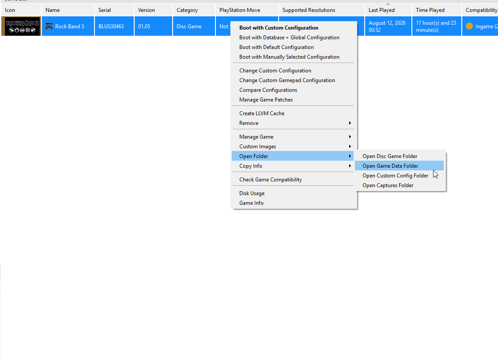
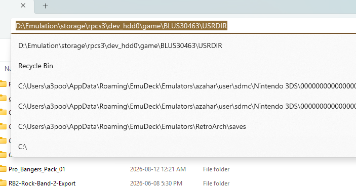

# DTA Format

This provides the instructions in order to create a `song_map2.dta` file, which is what GoCentralUtils can use in order
to import songs into the database for [GoCentralScores](https://github.com/elcanadiano/go-central-scores). This
repository houses some, but not all, of the necessary steps for a user to take the `songs.dta` files from their `USRDIR`
directory in RPCS3, merges them, and outputs the master song map file.

## Prerequisites/Setup

In order to create a formatted `song_map2.dta` file, you will need the following installed:

- Git - [Windows](https://git-scm.com/install/windows)
- Rust (rustup) - [Windows](https://rust-lang.org/tools/install/)
- [Python3](https://www.python.org/downloads/)

For Linux users, I generally would expect `git` to be installed by default. Consult your distro's instructions on how
to install these.

This repository contains setup for GoCentralScores's PostgreSQL database and uses technologies such as `pnpm` or
Node.js. Installing these for the purposes of creating a formatted `song_map2.dta` is not necessary.

## Assumptions

We will have to get copies of a few repositories (using `git clone`) in order to build this file. I generally recommend
people work inside a `workspace` directory inside their home directory, although if you have preferences to keep your
repositories elsewhere, that is okay.

Let's open a Terminal. For Windows users, use Powershell (admin mode is likely preferred). Use whatever is your default
terminal if you are on a Linux distro.

You should be on the home directory already. For Linux users that should be `/home/<username>`, whereas for Windows
users, you should be on `C:\Users\<username>`. Check that by typing in the command, `pwd` (print working directory). The
expected output on PowerShell should look like this. Most shells on Linux should just print out the directory.

```
PS C:\Users\<you>> pwd

Path
----
C:\Users\<you>
```

If you type `ls` or `dir`, that lists files and directories in the current directory (by default).

From here, let's create a `workspace` directory using `mkdir` and then change directory into it (do not include the $,
that is a Linux convention).

```bash
$ mkdir workspace
$ cd workspace
```

If you type in `pwd` you should now be in the `workspace` directory.

## Setup and Build Arson

[Arson](https://github.com/hmxmilohax/arson) is an implementation of the DTA scripting language which Harmonix uses.
This repo contains two tools we will need, `arson-fmt` and `arson-run`. This section covers cloning the repo and then
building those two scripts for use within your terminal.

### Cloning Arson

First, we need to clone Arson. In GitHub, we need the URL to clone, which can be found in the Code button/dropdown. You
can choose any of the protocols but if you are not normally a coder, just choose HTTPS. To clone, you would just type
`git clone` with the URL as the argument, like as follows:

```bash
$ cd ~/workspace
$ git clone https://github.com/hmxmilohax/arson.git
```

Note that `~` is a shortcut for your home directory.

If you `ls`, an `arson` directory should be created. `cd` into it.

### Building arson-run and arson-fmt

From here, you should be inside the `arson` directory. `pwd` to make sure. We will build `arson-run` and `arson-fmt`
first using Rust's [cargo](https://doc.rust-lang.org/cargo/commands/cargo.html) command, then install it so that we can
just use the command.

#### Build

```bash
$ cargo build -p arson-fmt --release
$ cargo build -p arson-run --release
```

By building these two, an exe file is created in `arson/target/release/arson-run.exe`. Now we will install it so that
we can just call `arson-run` or `arson-fmt`.

#### Install

```bash
$ cargo install --path tools/arson-run
$ cargo install --path tools/arson-fmt
```

After this, you should be able to run `arson-run` or `arson-fmt`. If you add the `--help` flag afterwards, some
instuctions on what arguments and flags the command supports. If you see that, you're good to proceed.

```bash
$ arson-run --help
$ arson-fmt --help
```

## Obtain a copy of generator.zip

I currently do not want to house a copy of this without permission. If you can, download the zip and extract it within
the workspace directory. This guide will assume that this zip will be extrated to a `generator` directory within
`workspace`.

## Clone this repository

Similar to `arson`, we need to clone this repository within the workspace directory.

```bash
$ cd ~/workspace
$ git clone https://github.com/elcanadiano/go-central-utils.git
```

## Creating song_map2.dta

We should now have the following directories in our `workspace` directory. If you have these, then great!

- `arson`
- `generator`
- `go-central-utils`

There are effectively five steps we need in order to create the `song_map2.dta`. Previously, the first two steps were
tedious but two scripts in this repository aims to make those two steps much easier.

1. Copy the `song.dta` files from your packages from RPCS3 for Rock Band 3 Deluxe to `generator/song_merge` directory
2. Use `arson-fmt` and the `utf-8.py` scripts on each `song.dta` file
3. Run `arson-run` on `step1.dta` in `generator` to merge the formatted `song.dta` files into one large file
4. Run `arson-run` on `step2.dta` to update song updates from Rock Band 3 Deluxe are added
5. Run `arson-run` on `step3.dta` to purge songs with incomplete data

Now, let's get into each step.

### Copying song.dta files (Step 1)

We need to copy the `song.dta` files found in each song pack in your `USRDIR` directory for Rock Band 3 Deluxe in RPCS3.
These need to go into the `generator/song_merge` directory but when doing so, they need to be numbered, starting with 1.
For example, we would then have `song 1.dta`, `song 2.dta` (woo hoo!), etc.

To automate this, the `copy-songs-dta` script was provided in `scripts/bash` (for Linux) and `scripts/powershell` (for
Windows). It takes in a source directory (usually your `USRDIR`) and a target directory (usually
`generator/song_merge`). It will iterate through each directory within `USRDIR` and when it finds a `song.dta` file, it
will copy the file to the target directory.

We will assume that we `cd` into the `powershell` directory.

```PowerShell
PS C:\Users\<YOU>\workspace\go-central-utils\scripts\powershell> cd ~\workspace\go-central-utils\scripts\powershell
PS C:\Users\<YOU\workspace\go-central-utils\scripts\powershell> .\copy-songs-dta.ps1 <SOURCE_DIR> <TARGET_DIR>
```

Now, how do we get that `USRDIR`? This is how.

First, let's open RPCS3. Under the Rock Band 3 game, right click and go to Open Folder > Open Game Data Folder.



Then click on the `USRDIR`. Then click on the Address Bar which will give you an absolute path, which you can use for
the first argument.



The `TARGET_DIR` path, relative to the powershell directory, should just be:

```
../../../generator/song_merge
```

Thus, an example usage should be:

```PowerShell
PS C:\Users\<YOU\workspace\go-central-utils\scripts\powershell> .\copy-songs-dta.ps1 D:\Emulation\storage\rpcs3\dev_hdd0\game\BLUS30463\USRDIR ..\..\..\generator\song_merge
```

PowerShell users will likely have a restriction for running this in the first place, as by default, users cannot run
PowerShell scripts. In order to whitelist your own account, you can do the following:

```
Set-ExecutionPolicy -ExecutionPolicy RemoteSigned -Scope CurrentUser
```

If you need to ever re-restrict your ExecutionPolicy, you should be able to do so as follows:

```
Set-ExecutionPolicy -ExecutionPolicy Restricted -Scope CurrentUser
```

Readings: https://lazyadmin.nl/powershell/running-scripts-is-disabled-on-this-system/

### Running arson-fmt (Step 2)

We need to ensure that all of our `songs.dta` files in `generator/song_merge` all are properly formatted. The
`format-song-merge` script does just that. It just takes a `TARGET_DIR` path, runs `arson-fmt` on all of the DTA files,
then runs the `utf-8.py` file in the `generator` directory in order to make the DTA files UTF-8 compatible. The Target
directory in this case should be the `generator` directory instead of `song_merge`.

This will most likely work for most people:

```PowerShell
PS C:\Users\<YOU>\workspace\go-central-utils\scripts\powershell> cd ~\workspace\go-central-utils\scripts\powershell
PS C:\Users\<YOU\workspace\go-central-utils\scripts\powershell> .\format-song-merge.ps1 ..\..\..\generator
```

### Running arson-run (Steps 3-5)

With these two steps down, we can now run the `arson-run`. However, before we do that, we need to edit `step1.dta`.
Consider this code snippet:

```
{foreach_int $x 1 67 ;83
	{do
		($arr {array 0})
		($size 0)
		;{set $arr {read_file {sprint "main/out2.dta"}}}
		{set $arr {read_file {sprint "song_merge/songs " $x ".dta"}}}
		MAIN_LOOP
	}
}
```

The 67 in the example needs to be updated to the highest number of your song list + 1. For example, if there are 27
`song.dta` files in `generator/song_merge`, change the number to 28 and save the file. Then you can run the `arson-run`
files.

```bash
$ cd ~\workspace\generator
$ arson-run step1.dta
$ arson-run step2.dta
$ arson-run step3.dta
```

With that, a `song_map2.dta` is created, and you are done!
